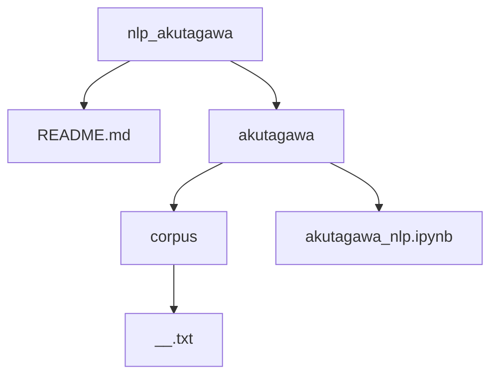

# What this does
This application could generate sentences which seem to be made by Akutagawa(Great writer).

Relevant KEYWORD: RNN, LSTM, GRU

This repository consists of the structure shown below.

## akutagawa_nlp.ipynb
Main component. All of prreprocessing, training code are here(No validation, Testing).

## corpus/__.txt
Raw data used for training and testing.
     
